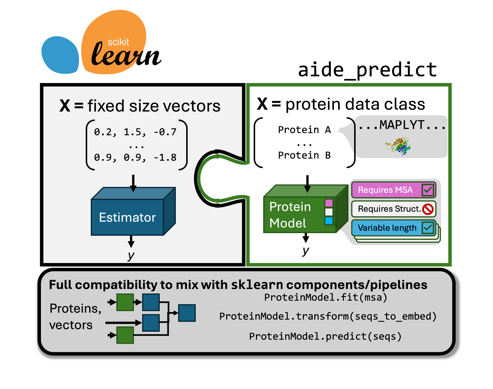

# AIDE
[](https://github.com/EvanKomp/aide_predict/actions/workflows/ci-tests.yml)
[](https://codecov.io/gh/EvanKomp/aide_predict)



This repository serves fundementally to increase the accessibility of protein engineering tasks that fall into the following catagory:

$$\hat{y}=f(X)$$

Here, $X$ is a set of proteins, eg. their sequence and optionaly structure. $y$ is a property of the protein that is difficult to measure, such as binding affinity, stability, or catalytic activity. $\hat{y}$ is the predicted value of $y$ given $X$.

Existing models $f$ in the literature are varied, and a huge amount of work has gone into designing clever algorithms that leverage labeled and unlabeled data. For example, models differ in the following ways (non exhaustive):
- Some require supervised labels $y$, while others [do not](https://www.nature.com/articles/s41587-021-01146-5)
- Unsupervised models can be trained on [vast sets of sequences](https://ieeexplore.ieee.org/document/9477085), or [MSAs of the related proteins](https://www.nature.com/articles/s41592-018-0138-4)
- Models exist to predict the effect of mutations on a wild type sequence, or to globally predict protein properties
- Some models incorporate [structural information](https://www.biorxiv.org/content/10.1101/2024.07.01.600583v1)
- Some models are [pretrained](http://biorxiv.org/lookup/doi/10.1101/2021.07.09.450648)
- Some models are capable of position specific predictions, which can be useful for [some tasks](https://journals.plos.org/ploscompbiol/article?id=10.1371/journal.pcbi.1009853) 

The variety an nuance of each of these means that each application is a bespoke, independent codebase, and are generally inaccessible to those with little or no coding exprience. Some applications alleviate the second problem by hosting web servers. Add to this problem is a lack of standardization in API across applications, where individual code bases can be extremely poorly documented or hard to use due to hasty development to minimize time to publication.

The goals of this project are succinctly as follows:
- [X] __Create a generalizable, unittested, API for protein prediction tasks that is compatible with scikit learn__. This API will allow those who are familiar with the gold standard of ML libraries to conduct protein prediction tasks in much the same way you'd see on an intro to ML Medium article. Further, it makes it much easier for bespoke strategies to be accessed and compared; any new method whose authors wrap their code in the API are easily accessed by the community without spending hours studying the codebase.
- [ ] __Use API components to create a DVC tracked pipeline for protein prediction tasks__. This pipeline will allow for those with zero software experience to conduct protein prediction tasks with a few simple commands. After (optionally) editting a config file, inputing their training data and their putative proteins, they can train and get predictions as simply as executing `dvc repro`.

## API examples:

AIDE examples look and feel like canonical sklearn tasks/code. Aide is not limited to only combinatorial/mutant data or global wt sequence predictors: it is meant for all protein property prediction tasks. The complete API and user guide is available at: https://beckham-lab.github.io/aide_predict/

See also the `demo` folder for some executable examples. Also see the [colab notebook](https://colab.research.google.com/drive/1baz4DdYkxaw6pPRTDscwh2o-Xqum5Krp#scrollTo=AV9VXhM6ebgI) to play with some if its capabilities in the cloud. Finally, checkout the notebooks in `showcase` where we conduct two full protein predictions optimization and scoring tasks on real data that are greater than small example sets. 

## Available Tools

You can always check which modules are installed/available to you by running `get_supported_tools()`. The following is a list of tools that are available. Models marked with a * require additional dependencies or envionments to be installed, see `Installation`

### Data Structures and Utilities
- Protein Sequence and Structure data structures
- `StructureMapper` - A utility for mapping a folder of PDB structures to sequences

### Prediction Models

1. [HMM (Hidden Markov Model)](https://journals.plos.org/ploscompbiol/article?id=10.1371/journal.pcbi.1002195)
   - Computes statistics over matching columns in an MSA, treating each column independantly but allowing for alignment of query sequences before scoring
   - Requires MSA for fitting
   - Can handle aligned sequences during inference

2. [EVMutation*](https://academic.oup.com/bioinformatics/article/35/9/1582/5124274)
   - Computes pairwise couplings between AAs in an MSA for select positions well represented in the MSA, variants are scored by the change in coupling energy.
   - Requires MSA for fitting
   - Requires wild-type sequence for inference
   - Requires fixed-length sequences
   - Requires additional dependencies (see `requirements-evmutation.txt`)

3. [ESM2 Likelihood Wrapper*](https://www.biorxiv.org/content/10.1101/2022.07.20.500902v1)
   - Pretrained PLM (BERT style) model for protein sequences, scores variants according to masked, mutant, or wild type marginal likelihoods. Mutant marginal computes likelihoods in the context of the mutant sequence, while masked and wild type marginal compute likelihoods in the context of the wild type sequence. These methods are apprximations of the joint likelihood.
   - Can handle aligned sequences
   - Requires additional dependencies (see `requirements-transformers.txt`)

4. [SaProt Likelihood Wrapper*](https://www.biorxiv.org/content/10.1101/2023.10.01.560349v2)
   - ESM except using a size 400 vocabulary including local structure tokens from Foldseek's VAE. The authors only used Masked marginal, but we've made Wild type, Mutant, and masked marginals avialable.
   - Requires fixed-length sequences
   - Uses WT structure if structures of sequences are not passed
   - Requires additional dependencies:
     - `requirements-transformers.txt`

5. [MSA Transformer Likelihood Wrapper*](https://www.biorxiv.org/content/10.1101/2021.02.12.430858v1.full)
   - Like ESM but with a transformer model that is trained on MSAs. The variants are placed at the top position in the MSA and scores are computed along that row. Wild type, Mutant, and masked marginals avialable.
   - Requires MSA for fitting
   - Requires wild-type sequence during inference
   - Requires additional dependencies (see `requirements-fair-esm.txt`)

6. [VESPA*](https://link.springer.com/article/10.1007/s00439-021-02411-y)
   - Conservation head model trained on PLM embeddings and logistic regression used to predict if mutation is detrimental.
   - Requires wild type, only works for single point mutations
   - Requires fixed-length sequences
   - Requires additional dependencies (see `requirements-vespa.txt`)

7. [EVE*](https://www.nature.com/articles/s41586-021-04043-8)
   - VAE trained on MSA, learns conditional distribution of AA. Latent space tends to be bimodal for deleterious vs neutral mutations.
    - Requires MSA for fitting
    - Requires fixed-length sequences
    - Requires independant EVE environment, see Installation.

### Embeddings for Downstream ML

1. One Hot Protein Embedding
   - Columnwise one hot encoding of amino acids for a fixed length set of sequences
   - Requires fixed-length sequences
   - Position specific

2. One Hot Aligned Embedding
   - Columnwise one hot encoding including gaps for sequences aligned to an MSA.
   - Requires MSA for fitting
   - Position specific

3. Kmer Embedding
   - Counts of observed amino acid kmers in the sequences
   - Allows for variable length sequences

4. [ESM2 Embedding*](https://www.biorxiv.org/content/10.1101/2022.07.20.500902v1)
   - Pretrained PLM (BERT style) model for protein sequences, outputs embeddings for each amino acid in the sequece from the last transformer layer.
   - Position specific
   - Requires additional dependencies (see `requirements-transformers.txt`)

5. [SaProt Embedding*](https://www.biorxiv.org/content/10.1101/2023.10.01.560349v2)
   - ESM except using a size 400 vocabulary including local structure tokens from Foldseek's VAE. AA embeddings from the last layer of the transformer are used.
   - Position specific
   - Requires additional dependencies:
     - `requirements-transformers.txt`
     - `foldseek` executable must be available in the PATH

6. [MSA Transformer Embedding*](https://www.biorxiv.org/content/10.1101/2021.02.12.430858v1.full)
   - Like ESM but with a transformer model that is trained on MSAs. The embeddings are computed for each amino acid in the query sequence in the context of an existing MSA
   - Requires MSA for fitting
   - Requires fixed-length sequences
   - Requires additional dependencies (see `requirements-fair-esm.txt`)

Each model in this package is implemented as a subclass of `ProteinModelWrapper`, which provides a consistent interface for all models. The specific behaviors (e.g., requiring MSA, fixed-length sequences, etc.) are implemented using mixins, making it easy to understand and extend the functionality of each model.

## Helper tools
The tools within the API often require somewhat expensive input information such as MSA and structures. We provide high level interfaces to predict structures and compute MSAs, see the user guide.

## Installation
```
conda env create -f environment.yaml
pip install .
```

## Installation of additional modules
Tools that require additional dependancies can be installed with the corresponding requirements file. See above for those files. For example, to access VESPA:
```
pip install -r requirements-vespa.txt
```

Some tools were deemed to heavy in terms of their environment to be included as a pip module. These require manual setup, see below.

### Installation of EVE

To access the EVE module, first clone the repo (NOT inside of AIDE):
```
git clone https://github.com/OATML/EVE.git
```

__IMPORTANT__: set the environment variable `EVE_REPO` to the path of the cloned repo. This is used by AIDE to import EVE modules as it is not installable.

Build a new conda environment according to instructions/`.yaml` file there.

We recommend testing that the environment is set up correctly and that the package is using any GPUs but running their example script and observing the log.

__IMPORTANT__: set the environment variable `EVE_CONDA_ENV` to the name of the conda environment you created for EVE. This is used by AIDE to activate the EVE environment.

Confirm AIDE now has access to the EVE module:
```
from aide_predicts import get_supported_tools
get_supported_tools()
```

## Tests
Continuous integration only runs base module tests, eg.
`pytest -v -m "not slow and not optional"`

Additional tests are availabe to check the scientific output of wrapped models, that they meet the expected values, such as:
- Score of ESM2 log liklihood, MSATransformer, SaProt, VESPA, EVE against ENVZ_ECOLI_Ghose benchmark of [ProteinGym](https://proteingym.org/)
- run with `pytest -v -m tests/not_base_models`

## Citations and Acknowledgements
No software or code with viral licenses was used in the creation of this project.

The following deserve credit as they are either directly wrapped within AIDE, serve as code inspiration (noted in modules when necessary), or are used for testing:

1. Frazer, J. et al. Disease variant prediction with deep generative models of evolutionary data. Nature 599, 91–95 (2021).
2. Hopf, T. A. et al. The EVcouplings Python framework for coevolutionary sequence analysis. Bioinforma. Oxf. Engl. 35, 1582–1584 (2019).
3. Notin, P. et al. Tranception: protein fitness prediction with autoregressive transformers and inference-time retrieval. Preprint at https://doi.org/10.48550/arXiv.2205.13760 (2022).
4. Rao, R. et al. MSA Transformer. 2021.02.12.430858 Pre-print at https://doi.org/10.1101/2021.02.12.430858 (2021).
5. Hopf, T. A. et al. Mutation effects predicted from se-quence co-variation. Nat. Biotechnol. 35, 128–135 (2017).
6. Hsu, C., Nisonoff, H., Fannjiang, C. & Listgarten, J. Learning protein fitness models from evolutionary and assay-labeled data. Nat. Biotechnol. 40, 1114–1122 (2022).
7. Meier, J. et al. Language models enable zero-shot prediction of the effects of mutations on protein func-tion. Preprint at https://doi.org/10.1101/2021.07.09.450648 (2021).
8. Verkuil, R. et al. Language models generalize beyond natural proteins. 2022.12.21.521521 Preprint at https://doi.org/10.1101/2022.12.21.521521 (2022).
9. Su, J. et al. SaProt: Protein Language Modeling with Structure-aware Vocabulary. 2023.10.01.560349 Preprint at https://doi.org/10.1101/2023.10.01.560349 (2023).
10. Marquet, C. et al. Embeddings from protein language models predict conservation and variant effects. Hum Genet 141, 1629–1647 (2022).
11. Eddy, S. R. Accelerated Profile HMM Searches. PLOS Computational Biology 7, e1002195 (2011).
12. Pedregosa, F. et al. Scikit-learn: Machine Learning in Python. MACHINE LEARNING IN PYTHON.
13. Notin, P. et al. ProteinGym: Large-Scale Benchmarks for Protein Fitness Prediction and Design.

## License

This project is licensed under the [MIT License](LICENSE).
